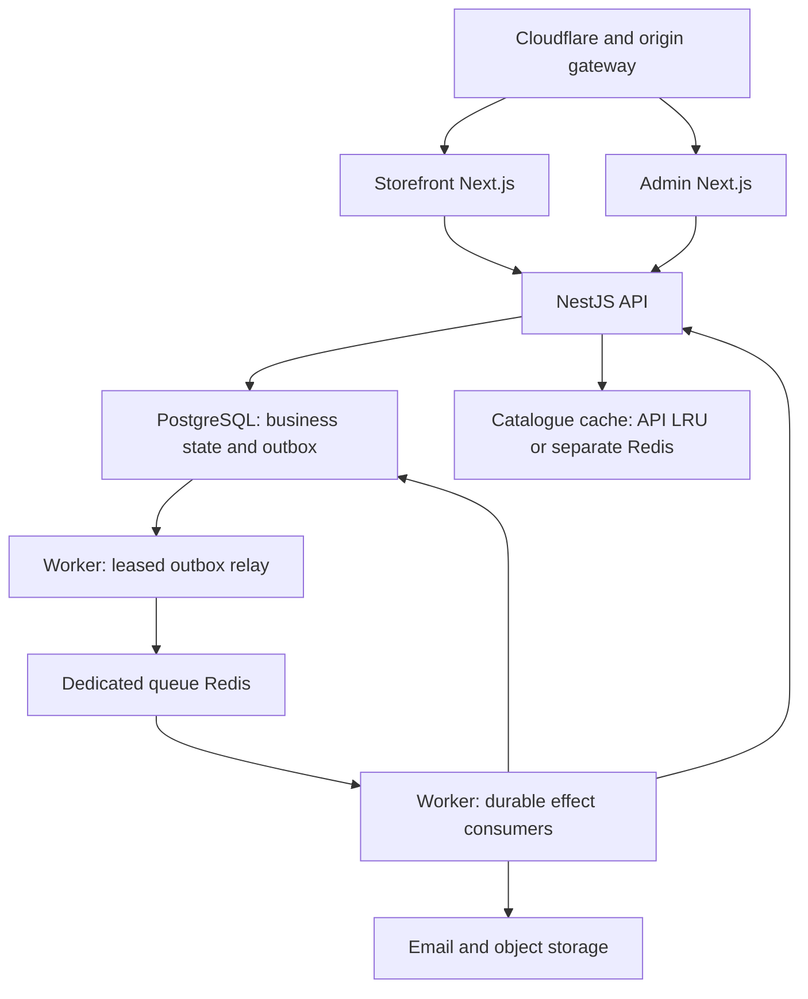
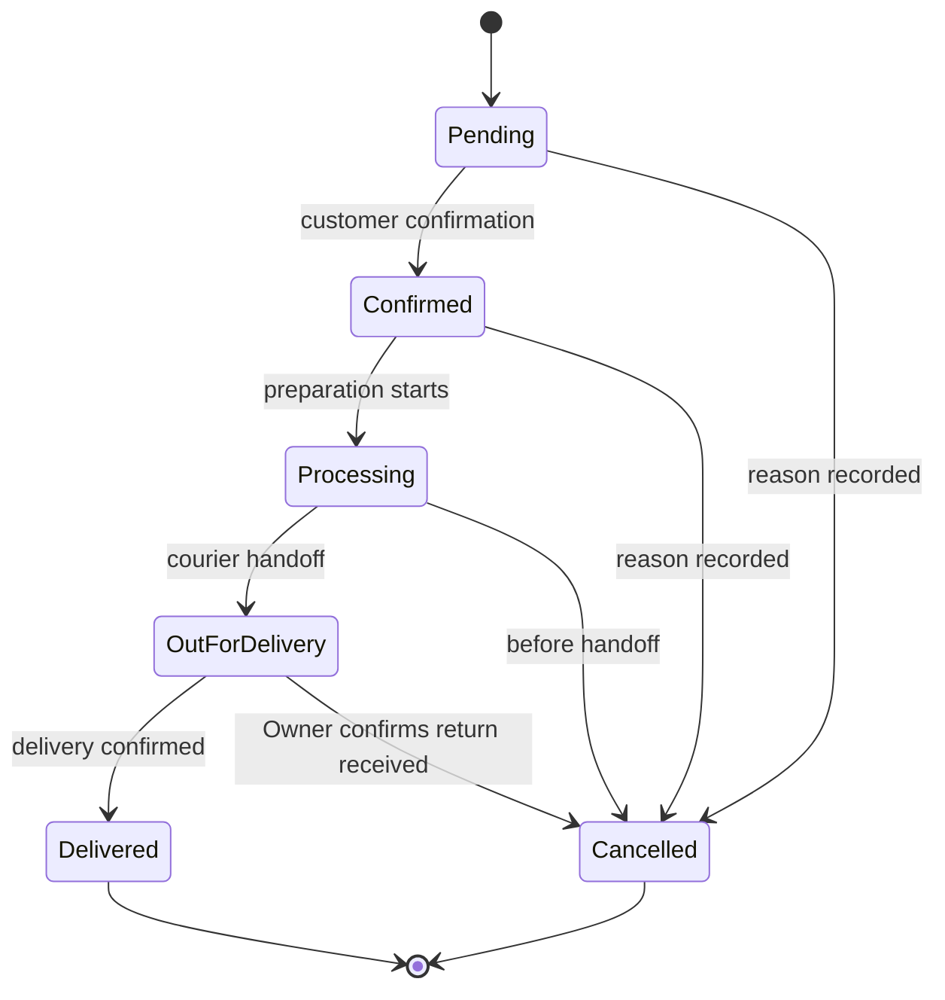
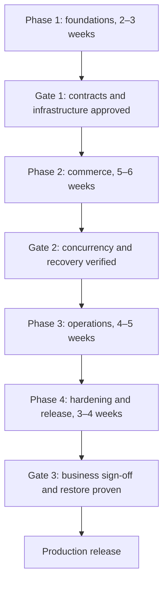

# Iqos Haven — Production Tech Stack & System Architecture

**Final engineering specification · Revision 2 · 6 October 2026**  
**Project owner:** Marina Akter  
**Basis:** the supplied storefront and admin prototypes, and the modified architecture specification.  
**Status:** implementation baseline. Production release requires the acceptance gates and business decisions in this document; this specification is not evidence of a deployed or tested system.

## 1. Executive summary

Build a TypeScript modular monolith with four deployables: a Next.js storefront, a separate Next.js admin dashboard, a NestJS/Fastify API, and a BullMQ worker. PostgreSQL is the authoritative record for orders, variant stock, coupon usage, sessions, checkout idempotency and durable background work. Redis accelerates delivery and reads; losing Redis must not erase accepted orders or their outstanding business effects.

The launch business scope is an English-language, Dubai-only store with approximately 50 products, guest checkout, Cash on Delivery, an 18+ gate, percentage coupons, one flat delivery fee, and Owner/Staff access. Saleable flavours, nicotine strengths and colours have individual SKUs and stock from launch. No customer accounts are required.

| Layer | Production baseline | Purpose |
| --- | --- | --- |
| Runtime | Node.js 24 LTS; exact supported patch pinned | One supported runtime across API, worker and front ends |
| Storefront | Next.js 16 App Router, TypeScript, Tailwind CSS 4 | Server-rendered pages, small interactive islands, server-enforced age gate |
| Admin | Separate Next.js 16 app; TanStack Query/Table, React Hook Form, Zod, Radix UI | Operations UI with centrally enforced permissions |
| API | NestJS, Fastify, versioned REST, OpenAPI | One authority for business rules and database mutations |
| Database | PostgreSQL 18, Prisma, reviewed SQL for locking and indexes | Transactions, constraints, immutable commerce snapshots |
| Durable asynchronous work | PostgreSQL outbox and effect ledger → BullMQ | At-least-once execution with idempotent effects and recovery |
| Queue | Dedicated Redis-compatible instance supporting BullMQ | No eviction; provider-supported durability and failover |
| Cache and rate limits | Budget: bounded API-process memory; replicated profile: separate cache Redis | Disposable reads and throttling; checkout has a bounded local outage fallback |
| Search | PostgreSQL full-text search and `pg_trgm` | Search and facets at launch; external search only after measurement |
| Media | S3-compatible object storage; Sharp; CDN | Quarantined uploads, validated images and immutable public derivatives |
| Infrastructure | UAE primary region; AWS `me-central-1` preferred subject to availability and provider acceptance | Managed state, private networking, reproducible containers |
| Edge | Cloudflare DNS/TLS/WAF; selected asset caching | Edge protection without bypassing the age gate |
| Quality | Vitest, real PostgreSQL integration tests, Playwright | Verify money, concurrency, security and complete business journeys |
| Delivery and operations | pnpm, Turborepo, Docker, Terraform, GitHub Actions, pino, OpenTelemetry, Sentry | Reproducible builds, controlled release and incident diagnosis |

Use a modular monolith because the current business benefits from one transaction boundary and a manageable deployment. Module interfaces and events allow later extraction when independent scale or release needs justify it. Launch excludes microservices, Kubernetes, Kafka, GraphQL, customer accounts, a page builder, online payments and the WhatsApp Business API. Fixed-value or brand-scoped coupons are future work, not hidden launch functionality.

Major versions are design choices, not floating dependencies. Pin package versions, lockfile, container digests and database/Redis engine versions after an integration build. Verify Prisma support, extensions, regional managed-service availability and security patches before provisioning. If PostgreSQL 18 is unavailable on the chosen provider, record an explicit architecture decision for another supported version and rerun compatibility tests; do not silently deploy PostgreSQL 16.

The implementation decisions fixed by this revision are: Read Committed with explicit business-row locks and database constraints; generic public store previews while product indexing remains off; a short-lived HttpOnly confirmation cookie instead of URL credentials; independently rotated age-ticket signing keys; accountant-confirmed VAT and excise treatment; one queue Redis on the budget profile; and a provisional 14–18-week delivery range for two experienced full-time developers. The acceptance gates, rather than elapsed weeks, determine release readiness.

## 2. Functional scope and prototype decisions

The prototypes define the visual and interaction contract. Production code implements those screens with real data, authentication, validation and recovery.

| Area | Storefront requirement | Admin requirement | Owning domain |
| --- | --- | --- | --- |
| Age gate | 18+ interstitial; rejection page; remembered decision; second checkout confirmation | Copy and duration in controlled configuration; no MVP management screen | Compliance |
| Catalogue | Disposables and kits; options, specs; New/Sale/Sold-out badges; up to eight images | Draft/publish, CRUD, trash, restore; actual variant rows | Catalogue |
| Categories and brands | Navigation, brand pages, Shop by Brand | CRUD, ordering, active toggle, logos, trash/restore | Catalogue |
| Search and filters | Suggestions; category, brand, price, puffs, nicotine, stock and sale facets; sorting | Search demand and no-result reports | Search / analytics |
| Cart | Device persistence, quick add, totals preview; delivery progress only when enabled | — | Pricing / client state |
| Promotions | Percentage coupon, minimum spend, expiry | Create, activate, inspect usage; Owner only | Promotions |
| Checkout | Guest COD, UAE mobile, apartment/villa/office, Makani, approved Dubai areas | Manual-order wizard | Orders / delivery |
| Orders | Private confirmation with order number | Six statuses, history, controlled edits, reasoned cancel, bulk confirm | Orders |
| Inventory | Sold-out remains visible; unavailable variants cannot be bought | Add/remove/set with reason; variant thresholds and alerts | Inventory |
| Customers | No account or login | Group by phone, history and spend; Owner export | Customers |
| Reviews | Approved reviews and rating summary; moderated submission | Pending/approved/rejected, verified order linkage | Reviews |
| Wishlist | Device-only saved products | Anonymous aggregate saves by product | Analytics |
| Delivery | One flat Dubai fee; ETA copy | Fee, approved area toggles; free threshold disabled initially | Settings / delivery |
| Storefront content | Ticker, hero, featured, best sellers, brands, campaign banner, offers | Seven schema-defined sections; draft and publish | Content |
| SEO | Clean URLs, metadata, OG, canonical, redirects, sitemap | Owner metadata editor and issue report | SEO |
| Notifications | — | Per-user bell/read state; new-order and low-stock email; daily summary | Notifications |
| WhatsApp | Context-aware `wa.me` links | Status message templates; staff manually sends | Settings |
| Analytics and reports | Minimal anonymous events | Revenue, AOV, cancellations, status mix, product/brand performance, five CSV reports | Analytics / reports |
| Staff and auth | — | Email/password, invite/reset, Owner/Staff, deactivate, idle timeout | Identity |

The initial Dubai-area list comes from the approved prototype dataset (45 entries); the client verifies names, coverage and exclusions. Never interpret selecting an area as independent proof that a typed address is inside the delivery boundary.

| Prototype conflict | Final launch decision |
| --- | --- |
| Storefront demo fixed/brand coupons versus admin percentage coupons | Percentage only; remove unsupported demo codes; future types require a separate implementation |
| Free delivery over AED 150 versus flat-fee brief | Flat fee. Free threshold and progress UI stay off until explicitly configured and approved |
| Per-flavour sold-out versus product stock field | Every saleable option combination has stock. Product list shows a sum; editor shows variant rows |
| Automatic Delivered → Collected | Delivery and COD collection are separate confirmed actions |
| Storefront WhatsApp alerts versus no Business API | Bell and email at launch; `wa.me` is a user-initiated message link |
| SEO crawler access through the age gate | Product indexing disabled initially; generic store-name/logo previews remain available without product disclosure |
| Public brand naming | Configuration-controlled; client confirms Iqos Haven versus earlier Vape Haven wording |

## 3. System architecture and trust boundaries



The diagram describes authority and work delivery, not arbitrary database access. API repositories and worker application services share reviewed modules; front ends never receive database credentials. Worker writes occur only through the same domain/application rules as API writes. The worker also reconciles outstanding effects directly from PostgreSQL when queue state is missing.

**Browser routing.** The storefront uses its own origin for `/api/v1/store/*` and the age endpoints. The admin uses `admin.<confirmed-domain>/api/v1/*` for auth, admin commands and SSE. An allowlisted origin gateway/reverse proxy forwards those routes to the private NestJS service. It adds no pricing, inventory or authorization logic. Preserve request IDs, streaming responses and correct cookie headers.

The API need not have a publicly reachable `api.<domain>` at launch. If an external API is introduced later, create an explicit client authentication and CORS policy. Never expose private admin routes merely to make front-end networking convenient. The admin origin is `noindex`, but its protection is session authentication and RBAC.

**Age boundary.** Storefront pages, server components, route handlers, catalogue JSON and checkout all require a valid server-verified age decision. The gateway/API verifies the signed age ticket forwarded from the storefront. It must not trust a browser-supplied `X-Age-Verified` header; strip such headers at ingress. If using a service assertion, authenticate the storefront service and bind the assertion to its request with a short expiry. Restrict direct origin access.

**State boundary.** PostgreSQL owns correctness. Queue Redis is a work transport. The single-API budget profile uses a bounded in-process catalogue cache and local throttling; neither is a correctness authority. The replicated profile introduces separate disposable cache Redis. When a Redis cache is deployed, it must be a separate instance/service from queue Redis: separate database numbers on one process do not isolate memory limits, eviction policy or failure. The topology shows both cache choices; workers invoke authenticated invalidation on the API cache owner rather than mutating an inaccessible process cache directly.

## 4. Application stack and repository

### Storefront

Use Next.js App Router server components for gated home, category, brand, product, offers and help pages. Use client components for cart, wishlist, compare, recently viewed, filters, suggestions, variant selection, quick add, checkout and sheets. Reuse the prototype's colour, radius, spacing and typography tokens. Load Poppins and JetBrains Mono through `next/font` with appropriately limited weights.

Zustand with persistence stores product/variant IDs, quantity and lightweight display snapshots on the device. Persisted prices and availability are previews; a server quote is required before checkout. Customer name, phone, address, Makani and delivery notes remain in checkout component memory; do not persist them in localStorage or sessionStorage. In particular, do not port the prototype's `store.set("co", state.co)` or `store.get("co", ...)` behavior. Remove any legacy `co` payload if a prototype-derived storage namespace is reused. The checkout-attempt key and non-PII creation metadata may persist for retry recovery. Device lists tolerate deleted products and inactive variants. Quick add opens a selector when an option choice is required; it never silently picks an unavailable flavour.

Use `next/image` with a tightly configured media host. The application enforces the gate before fetching or rendering restricted catalogue content. `proxy.ts` handles routing checks, supplemented by API and page-level validation; middleware alone is insufficient.

### Admin

Use TanStack Query for server state, TanStack Table for pagination, React Hook Form/Zod for forms, Radix primitives for accessible controls, Recharts for reports and `dnd-kit` for ordering. Avoid optimistic success for stock or status mutations; show the committed API response and refresh affected queries. Editing forms send a version and explain conflicts.

The product list displays total active variant stock. Product editing exposes SKU, option combination, price override, stock, threshold and active status for each variant. A product without options has one default variant; a product with selectable options has the real combinations from launch. No later stock migration is needed to make the prototype's flavour-level availability work.

### API and worker

NestJS/Fastify controllers validate contracts and delegate to application services. Prisma handles ordinary reads/writes; parameterized SQL handles conditional stock updates, explicit row locks, queue leasing and advanced indexes. Review transaction isolation and retry handling in the database layer. Zod contracts and OpenAPI-generated clients must agree; verify this during CI rather than assuming a generator covers every shape.

The worker is a standalone Node/Nest process reusing application services. Queues cover email, notifications, media, reports, rollups and scheduled tasks. `LISTEN/NOTIFY` may wake the relay, but periodic polling remains the durable fallback. An email adapter supports the chosen provider; templates use React Email. Sharp processes images outside HTTP request execution.

### Repository layout

```text
iqos-haven/
  apps/
    storefront/
    admin/
    api/src/modules/
      identity/ compliance/ catalog/ inventory/ pricing/ promotions/
      orders/ customers/ delivery/ reviews/ content/ seo/ search/
      notifications/ analytics/ reports/ settings/ media/ reliability/
    worker/
  packages/
    db/                  Prisma schema, reviewed SQL, migrations, environment-specific seeds
    contracts/           Zod request/response contracts and generated API client
    domain/              Pure pricing, coupon, delivery and state-transition rules
    application/         Shared transactional services and effect handlers
    design-tokens/ ui-core/ logger/ config/ eslint-config/
  infrastructure/
    terraform/ docker/ caddy/
  docs/
    architecture.md decisions/ runbooks/ data-flows.md
  .github/workflows/
  CLAUDE.md PROGRESS.md
```

Modules own repositories. Cross-domain synchronous work calls a service within a shared transaction context; order creation must not use separate transactions for inventory and coupons. After-commit work uses outbox events. Notifications are not imported by Orders. `packages/domain` contains no framework or database imports. UI calculations are estimates based on shared rules and current server configuration; the committed server quote remains authoritative.

Staging may use sanitized prototype demo data. Production bootstrap creates approved settings and the first Owner through a one-time secure process. Production never runs the demo seed or uses prototype passwords, contacts or coupon codes.

## 5. Data model and database invariants

The baseline has **40 logical tables**. UUIDv7 is the default entity identifier; join tables and daily aggregates may use composite primary keys. Store timestamps as UTC `timestamptz`; report dates and schedules use `Asia/Dubai`. Use integer fils for money and integer basis points for percentages. Serialize wide numeric values safely; never convert an unbounded database integer into an unsafe JavaScript number.

| Group | Table | Required fields and invariants |
| --- | --- | --- |
| Catalogue | `brands` | Unique normalized slug, name, logo asset, description, active, sort order, SEO, deleted_at |
| Catalogue | `categories` | Unique normalized slug, name, image asset, active, sort order, SEO, deleted_at |
| Catalogue | `products` | Unique slug, name, brand/category FK, type disposable/kit, puff count, draft/published, base price, compare-at price, approved VAT/excise-treatment reference/version, specs, description, SEO, is_new, version, deleted_at |
| Catalogue | `product_options` | Product FK, name, allowed values; unique product/name; values validated |
| Catalogue | `variants` | Product FK, globally unique SKU, normalized option signature unique within product, attributes, price override, stock_on_hand ≥ 0, threshold ≥ 0, active, is_default, version |
| Catalogue | `product_images` | Product FK, validated asset FK/key, primary flag, sort order, alt, dimensions, MIME; at most eight published images and one primary |
| Catalogue | `slug_redirects` | Entity type, old slug unique within route namespace, target entity/current slug; prevent cycles and namespace collisions |
| Orders | `customers` | UUID identity, normalized unique phone_e164, display name, first_order_at, operational no-show flag; no customer authentication |
| Orders | `customer_addresses` | Customer FK, area FK, type, building/unit/street/Makani/notes; not the source for past orders |
| Orders | `orders` | Unique order_number, customer FK, customer/address snapshots, six-state status, source, monetary snapshots, tax/config versions, COD status, collected amount/at/by and correction history, age confirmation, actor, version, dispatch/return timestamps, unique creation scope/key, confirmation capability hash/expiry |
| Orders | `order_items` | Order/product/variant FK, product/SKU/option/brand/category/unit-price/tax snapshots, quantity > 0, line subtotal and discount allocation; one merged row per variant/order |
| Orders | `order_status_history` | Order FK, from/to, reason, actor or system identity, timestamp, command ID; append-only |
| Inventory | `stock_movements` | Variant FK, signed delta, balance_after, reason, order/command reference, actor, timestamp; append-only; unique command/variant/effect |
| Marketing | `coupons` | Unique normalized uppercase code, percentage basis points, min subtotal, starts/expires_at, active, usage_limit, active_redemptions, version; no launch fixed/scope engine |
| Marketing | `coupon_redemptions` | Coupon/order FKs, discount snapshot, redeemed_at, released_at; unique order; release exactly once |
| Marketing | `reviews` | Product/order link, author display, rating 1–5, title/body, pending/approved/rejected, moderation actor/time; verified flag derived from authenticated order proof |
| Marketing | `content_sections` | Unique section key, schema_version, validated draft/published JSON, version, published_at/by |
| Settings | `delivery_areas` | Unique name, active, stable external/code identifier; Dubai-only launch; later zone fees require an approved extension |
| Settings | `settings` | Unique key, validated value JSON, version, updated_by/at; store/contact/delivery/notifications/WhatsApp/age/tax configuration |
| Identity | `staff_users` | Unique normalized email, argon2id hash, name, role FK, active, encrypted optional TOTP secret, last_active_at |
| Identity | `roles` | Unique name; Owner and Staff seeds; protected last-Owner invariant |
| Identity | `permissions` | Unique granular permission key |
| Identity | `role_permissions` | Composite unique role/permission; explicit grants only |
| Identity | `sessions` | User FK, unique random-token hash, created/expires/last_seen/revoked_at, minimized IP/device metadata |
| Identity | `password_reset_tokens` | User FK, unique token hash, expiry, used_at; atomic one-time consumption |
| Identity | `staff_invitation_tokens` | Invited user/email, token hash, role, expiry, accepted/revoked_at, inviting actor |
| Reliability | `idempotency_records` | Unique endpoint/principal-scope/key, canonical request hash, optional aggregate reference, response status/body, separately encrypted replay_cookie_material, created_at, replay_expires_at; delete cookie material at capability expiry |
| Reliability | `outbox_events` | Stable event ID, type/schema version, aggregate ID/version, minimal payload, created_at, lease owner/expiry, dispatch attempts, last error, dispatched_at hint, completed_at |
| Reliability | `consumer_effects` | Unique event/consumer, payload reference, pending/queued/running/retry/completed/dead/skipped, attempts, lease/heartbeat, due_at, completed_at, last error, external receipt |
| Reliability | `notifications` | Unique source event/type, title/body/link, created_at; shared immutable content without a shared read flag |
| Reliability | `notification_receipts` | Notification/user composite unique, delivered_at, read_at; recipients snapshotted according to permissions |
| Reliability | `report_jobs` | Type, validated params, state, artifact key, requester, permission scope, created/completed/expires_at, error |
| Reliability | `audit_log` | Actor, entity/action, redacted structured diff, request/command ID, timestamp; append-only |
| Reliability | `media_assets` | Owner, quarantine key, observed bytes/type/dimensions/hash, processing state, derivative keys, expiry, error |
| Reliability | `scheduled_runs` | Unique job name/schedule slot, state, lease, attempts, completed_at; durable scheduling and catch-up |
| Analytics | `events` | Event ID/type, validated bounded payload, optional short-lived anonymous ID, timestamp; monthly partitions only when volume warrants |
| Analytics | `sales_daily` | Dubai date, booked/delivered/collected monetary measures, placed/cancelled counts; unique date; definition version |
| Analytics | `product_sales_daily` | Dubai date/product/brand, ordered/delivered units, allocated sales/discount/tax; composite unique |
| Analytics | `search_daily` | Dubai date/normalized term, search count, zero-result count, result-count total; composite unique |
| Analytics | `wishlist_daily` | Dubai date/product, adds/removes; composite unique; device event estimate |

Database checks enforce valid quantities, nonnegative stock, percentages from 1 through 10,000 basis points and bounded nonnegative money. Define configured cart/line quantity caps and reject overflow before calculation. Cross-row rules such as the maximum image count, sole default variant and last active Owner require a transactional application check with an appropriate parent lock, supplemented by unique/partial constraints where possible. Do not claim a JSON schema or UI validation enforces these database invariants.

Use PostgreSQL **Read Committed** for launch commerce transactions. Correctness comes from atomic conditional stock writes, locked coupon counters, locked/versioned orders, consistent price/configuration reads and unique idempotency/ledger constraints. Every write path, including imports and admin adjustments, obeys the same invariants. Do not replace these controls with an assumption about the isolation level.

The resource order is: idempotency claim → existing order if applicable → customer if mutated → settings keys and delivery-area rows → catalogue parent/price rows → coupons → variants. Lock each group in a deterministic key/ID order and skip groups that are not used. Hold `FOR SHARE` on the relevant price/tax/delivery/published-state rows while validating and snapshotting them; mutable coupon counters and variant balances use `FOR UPDATE` or equivalent conditional writes. Catalogue edits acquire their parent/product rows before affected variants. Cancels lock the order before coupon and inventory effects. Never acquire an earlier group after a later one. Keep the transaction short and perform no network calls inside it.

Retry deadlock/approved transient transaction failures by restarting the whole transaction, initially at most three attempts with jitter; exhausted contention returns a retryable response without accepting another order. A failed unique-key statement requires rollback before reading the committed winner in a fresh transaction. Implement the wrapper against the exact pinned Prisma version and PostgreSQL error codes; test commit-time errors as well as statement-time errors. Use Serializable only through an explicit ADR for an invariant that is not adequately protected by this locking design, with its own retry/load tests. It is neither a launch default nor universally harmful. Database sequences can have gaps after rollback; order numbers are unique, not guaranteed consecutive.

**Snapshots and deletion.** Orders retain customer/address, product/variant, price, coupon, delivery and tax snapshots. Catalogue deletion never changes history. Soft-delete products, brands and categories; block deletion of a parent still needed by published products or perform an explicit transactional reassignment. Hard purge is Owner-only and blocked by historical foreign keys. Archive referenced catalogue records instead; do not cascade-delete order items or stock movements. Public media derivatives may be removed only when unreferenced by live or retained records.

**Initial stock.** Import/restock creates an `INITIAL_STOCK` or `RESTOCK` movement from zero. All future changes use the ledger, including order edits, cancellation, damage and returned goods. No direct stock update is permitted outside the inventory service. A reconciliation compares current stock with ledger sums and alerts on mismatch.

**Indexes.** Unique order number is its own lookup index. It is not the first column of a universal status/customer/reporting index.

| Query | Initial index / constraint |
| --- | --- |
| Order number / SKU / phone / coupon | Separate normalized unique constraints |
| Status order list | `orders(status, created_at DESC, id DESC)` |
| Customer order history | `orders(customer_id, created_at DESC, id DESC)` |
| Date-based reports | `orders(created_at DESC, id DESC)`; collection reports additionally index collected_at |
| Published catalogue | Partial published/nondeleted index for common category/brand + sort paths; choose actual order from measured query plans |
| Variant availability | `variants(product_id, active)`; unique product/option_signature |
| Search | GIN `tsvector` document, trigram index on normalized searchable text; bounded term length |
| Stock ledger | `stock_movements(variant_id, created_at, id)` and unique command/effect |
| Pending reviews | `reviews(status, created_at, id)` |
| Notification inbox | Receipts `(user_id, read_at, notification_id)` |
| Relay / recovery | Partial indexes on incomplete outbox and due unfinished effects; lease expiry included in query plan |
| Idempotency | Unique scope/key; permanent order creation key reference |
| Analytics | Date/product or date/term aggregate keys; raw event timestamp |

Review `EXPLAIN ANALYZE` with representative data. Add indexes to support measured queries, not every possible column combination. UUIDv7 improves insertion locality compared with random UUIDs; it is neither an access token nor a secrecy mechanism.

## 6. Commerce rules

### Pricing, tax, delivery and coupons

All calculations run on the API. Merge duplicate variant lines before checking quantities, stock or limits. Apply the current active variant price override or product price; ignore client price fields. Return a short-lived signed quote with price/config versions, fingerprint and expiry. Submission recomputes and validates that quote inside the transaction. If prices, eligibility or totals changed, return `409 QUOTE_CHANGED` and require acceptance of the new quote; do not silently charge a different total.

Launch coupon policy: one percentage code per order, no stacking, applied to merchandise only, minimum spend tested on the pre-discount merchandise subtotal, expiry tested against server time. Store percentage as basis points. Calculate the order discount with integer arithmetic and half-up rounding once per order; allocate it deterministically across lines using the largest-remainder method for reports. The active redemption limit is checked and incremented while the coupon row is locked, in the same transaction as order creation. A pre-delivery cancellation releases that redemption once and decrements the active count; redemption/release history remains auditable. A delivered order does not release usage through this flow.

One configured flat delivery fee applies to an active approved Dubai area. Free delivery remains off. If later enabled, define its threshold on merchandise subtotal after coupon discount and before delivery, and make the progress UI use the same server configuration. The area and fee are snapshotted on the order.

**Tax release decision:** the client must supply the approved VAT applicability/rate, tax-inclusive or exclusive price basis, display wording and invoice obligations. No rate is guessed. The configuration stores a policy version, integer rate in basis points, price basis and merchandise/delivery taxability. Discount allocation uses the configured selling-price basis. For each discounted line amount `A` and applicable rate `r`: inclusive tax is `round_half_up(A × r / (10,000 + r))`, with line net `A − tax`; exclusive tax is `round_half_up(A × r / 10,000)`, with line gross `A + tax`. An untaxed line has zero tax. Apply the approved delivery tax policy separately, using the same declared basis. Grand total is the sum of discounted line gross amounts plus delivery gross. Store basis subtotal/discount, merchandise net/tax/gross, delivery net/tax/gross and grand total so no amount is counted twice. Thresholds operate on the explicitly labelled selling-price basis. If the approved invoicing policy requires different rounding, record and test that revision before release. Checkout cannot launch with unresolved tax configuration or unverified worked examples.

**VAT and excise treatment must be confirmed by the client's accountant.** UAE Cabinet Decision No. 197 of 2025, effective 1 January 2026, lists electronic smoking devices/tools and their liquids at a 100% excise rate. This rate is applied to the legally defined excise base; it is not an instruction to add 100% to the store's displayed retail price. The client's role as retailer, importer, producer or other taxable person, each product's classification, supplier tax-paid evidence, cost/selling-price treatment and retail invoice presentation must be recorded. Tax-paid procurement may already embed excise in the product cost and selling price; prevent charging it again by assumption. If the client has direct excise accounting obligations, define a separate approved accounting/integration scope instead of inventing a checkout excise line. Snapshot the approved product pricing/excise-treatment version alongside the VAT policy. The FTA legislation and taxable-person guide are linked in section 19; the accountant verifies the applicable current treatment before release.

### Order state machine



Database values are `pending`, `confirmed`, `processing`, `out_for_delivery`, `delivered`, `cancelled`. Storefront creates Pending. A manual order may create Confirmed only through a permissioned command that records the operator and confirmation evidence. Every transition uses the domain state machine, expected version, command idempotency and an append-only history row.

| Operation | Permitted behavior |
| --- | --- |
| Edit items, address or coupon | Pending/Confirmed only; recompute totals, coupon and stock deltas atomically; increment version and record diff |
| Processing edits | Notes and operational metadata only; changing merchandise requires a controlled earlier-state workflow, excluded from MVP |
| Cancel before handoff | Pending/Confirmed/Processing with required reason; exactly one stock release and coupon release |
| Cancel after handoff | Owner only, after return is physically received and all items are classified; restore only resellable quantity, record damaged quantity separately |
| Cancel Delivered | Forbidden; refunds/returns require a separate future workflow, not an arbitrary status change |
| Bulk confirm | Per-order versioned transitions, bounded batch, individual outcomes; retry cannot confirm twice |
| Mark Delivered | Records delivery actor/time; does not automatically mark COD collected |
| Confirm COD collection | Explicit authorized action records amount, collected_at/by and reference; requires Delivered in the launch workflow |

COD values are `pending`, `collected`, `not_collected`. New orders are pending; cancelled uncollected orders become not_collected. A Delivered order can remain pending until reconciliation. Prevent cancellation of an order already marked collected through the normal cancellation command. Correcting a collection record is Owner-only, requires a reason and an audit event; it cannot erase the original collection evidence. Financial dashboards distinguish delivered sales from collected cash.

Cancel and inventory adjustment commands use unique command IDs in the scoped idempotency ledger. Replaying a command returns its previous outcome; changed payload conflicts. An order row lock and unique ledger effects prevent two concurrent cancellations from returning stock twice. Lock coupon rows in sorted ID order when replacing/releasing a coupon, and variant rows in sorted ID order; use the resource order in section 5 for create, edit and cancel. Retry approved transient/deadlock failures within the bounded budget with jitter.

### Inventory and low stock

At order acceptance, decrement stock immediately; the cart does not reserve inventory. Conditional stock updates run under the order transaction and cannot take stock below zero. Abandoned carts therefore require no expiry reservation process.

Editing an order applies only net quantity deltas: release reduced/removed items and consume increased/new items within one transaction. Revalidate product availability and preserve snapshots for unchanged lines. Absolute set-stock uses a row lock, expected version and a ledger delta computed from the current balance. Staff always supplies a reason for adjustment.

Emit low-stock on crossing from above the variant threshold to at/below it. Deduplicate with variant/version/event identity. Re-arm after stock rises above the threshold. Threshold changes re-evaluate explicitly without sending repeated emails for every update while already low. Stock zero does not unpublish the product; a product is sold out when no active saleable variant has stock.

## 7. Checkout and idempotency

1. Persist a random checkout-attempt key in device storage across refreshes, resubmissions and network errors. Store only the key and creation metadata there. Generate a new attempt after acknowledged success or an explicit new checkout, not every page load.
2. Fetch a server quote; send variant IDs/quantities, validated delivery address/phone, coupon, quote fingerprint, second 18+ confirmation and `Idempotency-Key`. Normalize supported UAE mobile formats with a maintained phone library and an explicit mobile-region rule. Do not treat phone possession as verified identity.
3. Build a canonical payload hash: normalized and merged lines, customer/address, coupon, agreed quote fingerprint and relevant confirmations. Scope the key to the endpoint and authenticated principal for manual orders; storefront guest keys have high entropy and a fixed guest endpoint namespace.
4. Begin a PostgreSQL transaction. Claim the unique idempotency scope/key. A concurrent request must wait for the first transaction or receive a bounded retryable in-progress response. After a uniqueness conflict, read the winner's committed record: same hash replays the same success; different hash returns `409 IDEMPOTENCY_CONFLICT`.
5. Follow the complete resource order in section 5: upsert/lock the customer first when needed without rewriting old order snapshots, then lock and validate current settings/area/catalogue price and published-state rows, sorted coupons and sorted variants. Edits/cancels lock their existing order before those resources. Validate the quote, coupon limit, tax and stock against these locked records. Use a conditional decrement such as `UPDATE variants SET stock_on_hand = stock_on_hand - :qty, version = version + 1 WHERE id = :id AND active AND stock_on_hand >= :qty RETURNING stock_on_hand`; no returned row aborts the transaction.
6. Atomically write the order/items, stock decrements/movements, coupon redemption, history, idempotency response, outbox event and required effect records. Any failure rolls back all of them. No email or Redis call occurs inside this transaction.
7. Generate the confirmation capability before persisting the response; keep its verifier hash/expiry on the order and encrypt any replayable raw token in the idempotency record with a managed application key. Commit, then return the sanitized JSON response and set the storefront-origin confirmation cookie described below. A retry replays the same order response and restores the cookie only while that capability remains valid. The client clears the cart only after acknowledged success. On an uncertain network outcome it retries the same key; it does not submit a second order.
8. Background effects notify recipients, send email and refresh operational views. Their failure does not roll back an accepted order.

Store the successful response for at least 24 hours. Keep the key/hash/order linkage on the order for its retention lifetime so a cleaned-up response record cannot let an old key create another order. After replay expiry, return `409 CHECKOUT_RECOVERY_REQUIRED` or reconstruct a sanitized outcome using the retained matching key; never silently accept the key as new. A rolled-back attempt has no accepted order and may retry after correcting a business validation failure. Document this distinction in the UI.

The idempotency key is a random bearer-like secret: do not log it or include PII in it. Replay responses contain only the minimum order confirmation data. Full order/address details require the separate confirmation capability, not an order number or phone query. Order numbers are sequential display identifiers and do not authorize access. Store capability hashes; apply a limited lifetime and rate limit. No public endpoint enumerates orders by phone.

**Confirmation transport.** Launch uses a 256-bit opaque capability in `__Host-ih_order`, set from the storefront origin with Secure, HttpOnly, SameSite=Lax, Path=/ and no Domain; initial lifetime is 30 minutes. The browser navigates to `/order-confirmation` without a credential in its URL. The API resolves the cookie hash to the order and returns only the fields needed for confirmation. The cookie grants confirmation access, not order editing or general customer authentication. A new acknowledged checkout replaces it; only the latest order confirmation is supported in that browser at launch. Expiry does not create a new order or invalidate the successful checkout response; show an access-expired state with the already-known order number and shop contact route.

Do not put capabilities in URL query/path, localStorage, analytics events or logs. Confirmation routes and responses use `private, no-store` and `Referrer-Policy: no-referrer`; exclude them from third-party analytics/session replay and redact Cookie/Set-Cookie and capability-bearing payloads. The idempotency response body contains no raw capability. Encrypt replayable cookie material separately and delete it when its capability expires.

Cross-device/shareable confirmation links are deferred. If later required, use a separately reviewed fragment-to-POST exchange with an expiring, preferably one-time link credential, then establish a scoped cookie and immediately remove the fragment with history replacement before loading analytics. Fragments are not sent in HTTP requests or Referer headers, but JavaScript and browser history may still expose them; a fragment alone is not a complete leakage control.

Expected business errors include `INSUFFICIENT_STOCK`, `VARIANT_UNAVAILABLE`, `COUPON_INVALID`, `COUPON_LIMIT_REACHED`, `AREA_UNAVAILABLE`, `QUOTE_CHANGED`, `IDEMPOTENCY_CONFLICT` and `VERSION_CONFLICT`. Report the relevant variant/field without disclosing another customer's data.

## 8. Outbox, queues, notifications and failure recovery

Delivery is **at least once**, not exactly once. A committed outbox event makes unfinished effects discoverable after a crash. It does not prove that an email was delivered. A job ID reduces duplicates while a job exists; it does not replace database deduplication after job cleanup or Redis loss.

| Failure window | Required recovery |
| --- | --- |
| Commit succeeds, API response is lost | Checkout replays the committed database response |
| Worker crashes before enqueue | Expired outbox lease is retried |
| Enqueue succeeds, dispatched marker fails | Duplicate job may arrive; durable consumer key deduplicates its business effect |
| Redis loses an enqueued job after dispatch | Reconciler finds unfinished effect without a live lease/heartbeat and re-enqueues it |
| Consumer crashes before database commit | Transaction rolls back; effect can retry |
| Email provider accepts, response/ledger commit is lost | Retry with stable provider idempotency key when supported; otherwise an occasional duplicate is possible and must be reconciled |
| Permanent payload/provider failure | Effect becomes dead; alert, inspect, repair and permissioned replay |

The relay claims due events/effects using short leases and `FOR UPDATE SKIP LOCKED`; it never holds a database transaction across a broker network call. Use stable event/consumer job identifiers, bounded payloads and versioned schemas. Events carry IDs, not whole customer addresses or complete order documents. Consumers load authorized data when needed.

The initial event catalogue includes `order.created`, `order.updated`, `order.status_changed`, `order.cancelled`, `order.collection_recorded`, `inventory.low`, `catalog.changed`, `content.published`, `review.submitted`, `media.uploaded` and `report.requested`. Specify aggregate ID/version, event ID/schema version and the required consumer set for each. The business mutation and its required effect rows commit together. Adding a consumer requires a deliberate replay/backfill policy; it must not silently redefine completion of old events.

Each consumer claims its effect with a lease, checks for completion and writes database effects together with completion in one transaction. A unique source-event constraint protects notifications and rollup writes. Long jobs renew their lease/heartbeat. The reconciler avoids re-enqueueing currently active work; expired work can still redeliver, so idempotency remains mandatory. Mark the parent event completed only when its snapshotted required effects are completed or intentionally skipped with an audited reason; a dead effect is not successful completion. Enforce per-aggregate ordering only where required, using aggregate versions and transaction checks; do not assume all BullMQ queues preserve completion order.

Email uses a stable event/template/recipient delivery key where the provider supports idempotency, with its documented retention window. Store provider receipts and delivery outcome. If that support is absent, document at-least-once email with bounded duplicate risk; never claim “never sends twice.” Bounce/complaint callbacks are authenticated and idempotent. Dashboard notifications remain available even during email outages.

Default retries: transient errors use exponential backoff with jitter and a finite attempt/time budget; permanent validation errors go directly to investigation. Five attempts may be an initial transport setting, not a reason to discard unfinished work. Keep dead effects and source records until resolved under a retention policy. Prune only completed events after the recovery/audit window. Rebuild queue state from unfinished database effects after Redis recovery.

Queue Redis uses `noeviction`, memory alerts and provider-supported persistence/failover. For self-hosted Redis, assess AOF and restore tests. For managed Redis/ElastiCache, use its supported durability options; do not assume AOF can be enabled. The budget profile does not deploy cache Redis. When cache Redis is introduced, it may use eviction and has separate connection pools, credentials and monitoring. Queue memory is not used as a catalogue-cache fallback.

**Notification inbox.** Create immutable notification content once and one receipt per eligible recipient. Reading a notification changes only that user's receipt. Staff receives only permitted operational alerts; Owner receives financial summaries. Persist the notification before publishing an SSE wake-up. Redis pub/sub is a hint, not the inbox authority.

**SSE.** Use same-origin `/api/v1/admin/events/stream`; authenticate the session and permissions. Send event IDs and heartbeats, disable proxy buffering, set no-store, bound connection counts and configure idle timeouts. On reconnect, use Last-Event-ID or refetch the durable inbox; clients must tolerate duplicates and detect gaps. Recheck expiry/revocation periodically, close deactivated sessions promptly and reconnect after authentication. A missed SSE message must not hide an unread notification.

**Scheduling.** Daily summary runs at 09:00 Asia/Dubai; rollups, cleanup and reconciliation have explicit schedules. `scheduled_runs` makes a schedule slot unique across worker replicas. Catch up eligible missed runs after downtime. Configuration changes and scheduler retries must not send another summary for the same slot/recipient without a deliberate replay.

## 9. Age gate, publishing and cache behavior

### Age gate

Every restricted storefront request checks a signed server cookie before product data is rendered. No valid decision routes to an age-check page. Affirmation sets `ih_age`, Secure/HttpOnly/SameSite=Lax, with a signed expiry and configured duration (30 days proposed). Rejection clears age acceptance and sets a short-lived restricted cookie. Prevent open redirects in the return URL; allow local paths only. Protect decision POSTs with Origin validation and rate limits.

Checkout requires a fresh explicit 18+ checkbox even when the remembered gate exists. Persist the affirmation timestamp and applicable policy version on the order. The gate is an application control; any stronger verification or delivery verification is a client-approved business/legal policy, not a claim made by this architecture.

### Age-ticket keys and rotation

Use a vetted signing implementation with Ed25519/EdDSA and a fixed algorithm allowlist. Only the storefront server's age-accept handler can read the private signing key, held in the approved secrets manager under its service identity. Storefront verification and the API receive an allowlisted public-key set; the API cannot mint age tickets. No private key or token-signing secret enters a browser bundle, build output or log. The ticket includes `kid`, issuer, permitted audiences, issued-at/expiry, policy version and the explicit accepted decision. Validate signature, algorithm, issuer/audience, maximum lifetime and bounded clock skew; reject unknown/revoked key IDs. Do not retrieve keys from arbitrary URLs supplied by the token.

For rotation: provision the new public key to all verifiers first, confirm readiness, switch the signer to the new private key, and retain the previous public key until its last valid ticket has expired plus clock skew. With 30-day tickets the normal verification overlap may therefore last 30 days; two minutes of overlap is insufficient. Remove the retired private key after the controlled rollback window and retire its public key after ticket expiry. A compromised key is revoked immediately, without normal overlap; affected shoppers must pass the gate again. Record key IDs, issuance switch time, maximum expiry and rollback/revocation procedure in the secrets runbook. Age-ticket, signed-quote, internal-service and confirmation-encryption keys have separate purposes and access grants.

### Search indexing and social previews

Search indexing and social/link-preview exposure are independent policy decisions. Launch keeps search-engine access to product content off. Unverified requests to product URLs receive the age-check response with a consistent public store name, store logo, generic description and generic Open Graph metadata. Do not include product name, product image, price, SKU, JSON-LD or customer data in that response. A browser and a preview fetch see the same safe generic metadata; this requires no User-Agent-based bypass. Actual WhatsApp/Facebook preview display is platform-dependent and must be tested on staging. Product-specific previews require a separate approved exposure policy, not automatic access to the gated product page.

Public robots policy reflects the closed catalogue. A public sitemap initially lists only approved public store/policy pages; the product sitemap and product JSON-LD remain gated/inactive for external indexing. Public age-check, privacy/contact and required policy pages may be accessible without product details. No promise of organic product indexing is made while this policy is off.

If the client approves product indexing later, accept only verified search crawlers through a trusted edge assertion with origin protection, independently of social preview policy; a User-Agent string is never sufficient. Define cache behavior and exactly which metadata/content each audience may see, then test it before activation. Base titles, canonical/redirect rules and generic store previews stay in the launch scope. The full product SEO editor, issue report, indexing sitemap and JSON-LD activation work sits at the end of the Operations phase and depends on the indexing decision; unavailable indexing features are labelled inactive, not presented as working SEO.

### Publishing

Each of the seven section types has a versioned Zod schema. Draft and published payloads contain only allowed text, links and asset/product references; no arbitrary HTML or scripts. Save and publish are distinct permissioned commands with expected versions. Validate referenced products/assets before publishing. Product/brand/category/SEO changes and slug redirects commit with an invalidation event.

Slug changes reserve the old route and resolve directly to the current canonical URL, preventing loops and long chains. Store names/domains/contact values come from approved settings. `wa.me` templates escape content and contain no secrets; clicking the link does not establish that the message was sent.

### Cache contract

| Layer | Launch policy | Invalidation / correctness |
| --- | --- | --- |
| Browser and CDN: gated HTML/RSC/catalogue API | `private, no-store`; CDN bypass for these routes and cookies | Prevent an accepted visitor's response being served to an unverified visitor |
| CDN: public sanitized media and immutable build assets | Long-lived cache with versioned filenames | New content receives new keys; emergency removal uses explicit purge |
| Server catalogue/content data | Budget: bounded API LRU, TTL ≤60 s; replicated: separate shared Redis with tagged keys | Age authorization runs before serving a response; committed publish triggers cache-owner invalidation |
| Private admin/auth/checkout/quotes | `no-store` everywhere | No CDN or shared user-response cache |
| Optional future Next.js ISR/full-route cache | Only after gate-before-cache behavior is proven | Shared cache handler and distributed tag coordination across replicas; integration tests required |

Launch uses request-specific server rendering for gated pages with cached non-personal catalogue data. Avoid full-page CDN caching until a separately approved edge design enforces the gate before every cache hit. This costs some rendering work but makes the privacy/gate behavior clear at current volume.

On the budget profile, the **API process is the sole catalogue-cache owner**. Storefront server fetches use `cache: no-store` and do not create a second persistent Next data/full-route cache. Set explicit LRU byte/entry bounds, stable versioned keys and TTL of at most 60 seconds; eviction/restart causes ordinary database misses. API publication invalidates local entries after commit, and the durable worker effect retries an authenticated private API invalidation call. A missed invalidation therefore recovers through both retry and TTL. Worker and storefront are separate processes even on one host; neither assumes it can update the API's memory. Queue Redis pub/sub may wake SSE clients but holds no cached catalogue values.

Before adding another API cache-owner replica, adopt shared cache Redis and coordinated invalidation, or document/test another bounded-staleness design in an ADR. A second replica is a review trigger, not proof that Redis is the only possible cache technology. If cache Redis is unavailable, fall back to bounded local reads or direct database reads with miss/concurrency controls; checkout transactional reads continue to use PostgreSQL.

An authenticated internal revalidation endpoint handles appropriate Next tags if Next data caching is used. Its service secret is never shipped to the browser. Shared cache keys include deployment/schema version as appropriate. Configure a tested shared cache handler and distributed tag invalidation before multiple replicas depend on Next's built-in data/ISR cache; local per-instance disk/memory caches alone are insufficient. Deploy identical build artifacts and applicable framework encryption keys across replicas, and handle rolling-release asset/version compatibility.

Cloudflare purge and Next/application-cache invalidation are separate operations. An outbox effect retries invalidation and exposes lag. Target published content propagation within 60 seconds under normal conditions; monitor it. Stock display may briefly lag; checkout always reads current transactional stock. Purging CDN data cannot replace revalidating server cache.

## 10. API contract

Browser-visible endpoints use the same-origin `/api` gateway prefix. Nest routes begin `/v1`. “Guest” means no customer account; it does not mean bypassing the age gate, validation or rate limits.

| Surface | Representative routes | Required controls |
| --- | --- | --- |
| Age | `POST /api/age/accept`, `/reject` | Origin check, bounded rate; signed cookie |
| Store reads | `GET /api/v1/store/products`, `/products/:slug`, `/brands`, `/categories`, `/content/home`, `/search/suggest` | Valid age decision; published data only; private response policy |
| Quote / order | `POST /api/v1/store/cart/quote`, `/orders` | Age, validation, rate limits; orders require quote and idempotency |
| Confirmation | `GET /api/v1/store/order-confirmation` | Storefront-origin HttpOnly capability cookie; no URL token or order-number-only access; no-store |
| Reviews | `POST /api/v1/store/reviews` | Age, rate limit, moderation; signed order-review proof for verified label |
| Telemetry | `POST /api/v1/store/events` | Age where applicable, bounded schema/batch, rate limit; no customer PII |
| Admin orders | `/api/v1/admin/orders`, `/:id/transitions`, `/:id/cancel`, `/:id/collection`, `/bulk-confirm` | Session, granular RBAC, Origin/CSRF, versions, command idempotency |
| Admin operations | Products/variants/brands/categories/inventory/customers/reviews/coupons/areas/staff/content/SEO/settings | Session, per-action and per-field permission; audit as required |
| Notifications | `/api/v1/admin/notifications`, `/:id/read`, `/events/stream` | Recipient-specific receipts, same-origin authenticated SSE |
| Reports | `/api/v1/admin/reports/:type`, `/report-jobs/:id/download` | Owner permission at request and download; audit; private storage |
| Auth | `/api/v1/auth/login`, `/logout`, `/forgot`, `/reset`, `/invite/accept`, `/me` | Generic account errors, rate limits, server session, no-store |
| Internal | `/internal/revalidate`, relay/worker health | Private network/service auth; never public admin-cookie substitution |

Search accepts bounded `q`, filters, sort and pagination; whitelist sort fields and SQL identifiers. Return facet counts with documented applied-filter semantics. Page-number admin lists use bounded offset/limit initially; switch large timelines to cursors. SSE uses durable event IDs. Use stable secondary ordering by ID for every paginated list.

Error shape: `{"error":{"code":"VERSION_CONFLICT","message":"Record changed. Refresh and retry.","fields":[],"requestId":"..."}}`. Never return raw SQL, stack traces or unauthorized records. Admin writes require `If-Match`/expected version; stale writes return 409 and a permitted current version/record. `PATCH` rejects status/payment fields; those are explicit commands. Unknown fields are rejected, not silently mass-assigned.

CSV reports: small exports may stream; large exports become durable report jobs. Store files privately, authorize the requesting user and current permission again before download, issue short-lived links (15 minutes maximum) and audit customer-data exports. Sanitize spreadsheet formula prefixes in CSV text fields. Expire artifacts according to policy. Never allow a staff user to fetch an Owner's report by guessing a job ID.

Verified review proof is an opaque expiring token linked to an eligible delivered order and purchased product. Store a hash or signed constrained claim. A supplied order ID alone is insufficient. Allow a defined number of reviews per purchased product/order; show unverified submissions only if the client explicitly allows them, always moderated.

## 11. Authentication, RBAC and security

### Authentication and session routing

Admin sessions use a 256-bit random token with only its hash stored in PostgreSQL. Set `__Host-ih_admin` from the **admin origin**, Secure, HttpOnly, SameSite=Strict, Path=/ and without Domain. The same-origin gateway forwards it privately to Nest. A host-only cookie set on an API subdomain would not authenticate a different admin host.

Default idle timeout is 12 hours; absolute expiry seven days. Check active user, session expiry and revocation on every authorized request. Update last-seen in a throttled manner without extending absolute expiry. Password reset, staff deactivation and role-security changes revoke relevant sessions. Existing SSE connections recheck and close as described above.

Argon2id password parameters are benchmarked on the production runtime. Rate-limit login by IP and normalized identity with progressive delays, generic errors and protections against attacker-induced permanent account lockout. Reset tokens expire after 30 minutes, are hashed and consumed atomically once; responses do not disclose whether an email exists. Invitations use their own single-use expiring/revocable token flow and do not assign a role supplied by the invitee.

Protect the final active Owner from deletion, deactivation or demotion under Read Committed by first locking the seeded Owner-role row as the common identity guard, then locking affected staff rows in ID order and checking the current active-Owner count. Every Owner membership/activation change, including invites, bulk operations and operational tooling, takes that same guard before writing. This prevents two concurrent changes from independently removing the last two Owners; locking only each target user is insufficient. Document recovery of an unavailable Owner through an audited operational process. MFA is a deferred feature unless the client promotes it to the launch scope; encrypt any enrolled TOTP secret and implement recovery codes before enabling it. Never store an unencrypted secret just to claim readiness.

### Launch permissions

| Capability | Owner | Staff |
| --- | --- | --- |
| Orders read/create/edit/normal transitions and pre-handoff cancel | Yes | Yes |
| Confirm COD collection | Yes | Yes, explicit action and audit |
| Post-handoff return cancellation or collection correction | Yes | No |
| Products/variants/brands/categories read, create, edit, publish, trash/restore | Yes | Yes |
| Inventory read and reasoned adjustments | Yes | Yes |
| Customer operational contact and order history | Yes | Yes |
| Customer aggregate spend and customer export | Yes | No |
| Catalogue permanent purge | Yes, subject to reference checks | No |
| SEO fields, redirects administration and SEO reports | Yes | No |
| Dashboard revenue, analytics and reports/export | Yes | No |
| Reviews moderation and coupons management | Yes | No |
| Content, settings, delivery configuration, staff/roles | Yes | No |
| Notification inbox | Own eligible alerts | Own eligible operational alerts |

Seed explicit keys such as `orders.edit`, `orders.cancel_before_dispatch`, `orders.collect`, `inventory.adjust`, `catalog.publish`, `catalog.purge`, `seo.write`, `customers.financial_read`, `reports.export` and `customers.export`. Avoid broad wildcard grants that accidentally give Staff SEO, purge or exports. Nest guards enforce route actions; services enforce field and object scope. Staff may need unit prices/totals to fulfill an order; that operational access does not grant store-wide revenue or customer lifetime spend. Strip forbidden aggregate fields from responses.

Custom roles are deferred unless required. A normalized permission model supports them, but safe role editing, last-Owner checks and regression tests still require engineering work; it is not automatically a simple data change.

### Security controls

- Use TLS end to end, origin restrictions, HSTS and a tested CSP. Admin denies framing. Do not expose job dashboards or database/Redis endpoints publicly.
- SameSite cookies supplement CSRF controls: validate Origin on every state-changing cookie-authenticated request, use a CSRF token where the request flow needs it, reject unsupported content types, and apply the same rules to login/logout and upload authorization.
- Validate contracts at the API boundary; parameterize SQL; sanitize any allowed rich text; enforce output escaping and redirect allowlists.
- Rate-limit checkout by IP and privacy-conscious normalized-phone signals, plus global abuse controls. Use the explicit per-endpoint primary/outage policy below; a rate-limit cache failure alone must not close the checkout revenue path.
- Apply least-privilege IAM, separate migration and runtime database users, secrets management, encryption at rest and rotation. Never log session tokens, capabilities, reset links, full addresses or checkout bodies.
- Audit status/item changes, stock adjustments, coupon changes, collection corrections, exports, content publish, staff and settings changes. Redact sensitive diffs. Define retention and restricted audit access.

### Rate-limit and dependency outage policy

| Endpoint / dependency | Primary policy | Outage behavior |
| --- | --- | --- |
| Checkout and quote throttling | Budget: bounded local token buckets plus edge controls; replicated: shared cache-Redis counters plus edge controls | Shared limiter failure switches to bounded local IP/phone and per-instance global ceilings; alert and mark degraded; no unrestricted fail-open |
| Login, password reset and invite acceptance | Explicit strict policy: local authoritative limiter on the single-API budget profile; shared limiter on replicated profile; persistent token/session checks in PostgreSQL | If the configured authoritative limiter fails, fail closed for that endpoint; no silent unlimited authentication attempts |
| Catalogue cache | Bounded LRU or shared disposable cache | Bounded database misses/local fallback; limit concurrent cache misses |
| Queue Redis | Durable PostgreSQL effects, Redis transport | Checkout may still commit; alerts/reconciliation restore work after queue recovery |
| PostgreSQL, authorization or age verification | Required authoritative checks | Reject the affected request safely; limiter fallback cannot bypass these dependencies |

Local limiter buckets have explicit entry/byte caps, TTL cleanup, per-route budgets and a per-process global admission ceiling. Normalize phones, then use a purpose-specific keyed hash for temporary limiter keys; do not log raw phone keys. On bucket-capacity exhaustion, retain a conservative global ceiling instead of evicting into unlimited admission. Initial checkout limits are 10 attempts/minute/IP and five/minute/phone; initial shared-limiter outage defaults are five/minute/IP, two/minute/phone and 60 attempts/minute/API process. These are conservative configuration starting points, not measured safe capacity: verify or adjust them in staging before release, and configure quotes separately so normal cart repricing does not consume order-submission allowance. Count attempted submissions, not just successful orders. Tune for legitimate shared-IP use.

A local limiter is per process, resets after restart and cannot enforce a cluster-wide phone/IP budget. Record the maximum replica count and derive per-instance fallback ceilings accordingly; edge/global controls remain active. Emit an outage metric, log only non-PII context and restore the shared limiter automatically when healthy. Redis outage tests must show that a legitimate bounded checkout still works while abusive traffic is constrained. Database idempotency, stock and coupon controls remain unchanged in this mode.

### Media upload

Create an authenticated upload authorization and `media_assets` row. Upload into a private quarantine prefix. Prefer a signed POST policy with a content-length range when supported; otherwise enforce size at ingress and validate actual bytes before processing. A presigned PUT content-type header alone is not proof of size or file type.

Launch limits: eight product images, eight MB per source image, bounded dimensions/pixel count and processing resources. Verify magic bytes and decoder support, reject unsupported SVG/animated or malformed formats under the chosen policy, protect against decompression bombs, strip metadata and re-encode with Sharp. Publish only sanitized derivatives after successful processing. Originals remain private with short retention. Never trust an extension or client MIME declaration. Cleanup expired quarantine uploads and orphan assets through a durable job.

### Personal data and residency

Keep the primary customer database and private storage in the approved UAE region. This is not a blanket claim that all data remains in the UAE: Cloudflare, email, Sentry, telemetry and backups may process data elsewhere. Maintain `docs/data-flows.md` with each processor, payload category, region, retention, subprocessor and access control. Disable PII capture in monitoring, redact logs and minimize email content. Agree customer-data retention, anonymization and backup expiry with the client. Legal wording, age policy, sales eligibility and residency obligations require the client's approved policy; the architecture does not certify compliance.

## 12. Infrastructure and deployment

Choose the availability profile before purchasing. Both profiles use the same business services and durable-work contract; infrastructure, capacity and failure behavior differ.

| Component | Budget launch profile | Preferred production availability profile |
| --- | --- | --- |
| Storefront/admin/API/worker | Four container services on a UAE host; storefront/API single instances | ECS Fargate; storefront/API ≥2 replicas across available AZs, admin/worker sized by need |
| PostgreSQL | Managed PostgreSQL 18 with backups; single-AZ risk explicitly accepted | RDS PostgreSQL 18 Multi-AZ where region/provider supports it |
| Queue Redis | Dedicated managed/self-hosted instance with recovery plan | Dedicated managed Redis-compatible primary/replica with supported failover |
| Cache / limiter | Bounded in-process API LRU and local limiter; no cache Redis | Separate managed cache Redis for shared reads/throttling; independent scaling/eviction |
| Object storage | UAE-region private and public-derivative buckets | Same; versioning, encryption, lifecycle policies |
| Edge/gateway | Cloudflare plus Caddy/reverse proxy | Cloudflare plus ALB/origin gateway and private services |
| Email | Approved provider through adapter | Same; acceptance, quotas, deliverability and data flows verified |

Budget launch has application-host and possibly database/queue availability limits. Rebuilding from durable state is recovery, not zero downtime. If the business requires AZ failure tolerance, use the preferred profile from launch. Do not present a single queue node as highly available.

Provision AWS `me-central-1` only after confirming required services/engine versions, account quotas and provider terms for the actual product category. Container resources are initial estimates, not guarantees: test Next image/render memory and Node API/worker concurrency before setting CPU/RAM. Avoid combining media processing with email latency-critical workers when it causes starvation.

Use private subnets/security groups for database, queue and internal API; allow only required application identities/paths. Use ECR images, least-privilege ECS task roles, load-balancer health checks and managed secrets. Account for egress/NAT or VPC endpoint costs. Origin protection must prevent clients bypassing edge controls. Maintain DNS, certificate, key rotation and disaster-recovery runbooks.

Development uses Docker Compose with PostgreSQL, queue Redis, MinIO and Mailpit; a separate cache Redis profile is enabled when testing the replicated architecture. Staging reproduces the selected launch profile and exercises both local-cache behavior and planned replica/outage cases before scaling. Staging uses separate state, buckets, credentials and email destinations. Production has no shared database/cache/queue/storage/secrets with another environment. Staging sends no real customer notifications.

### CI/CD sequence

1. Pull request: lint, strict typecheck, contract generation/drift check, domain tests, real PostgreSQL integration/concurrency tests, migration validation and affected-app builds. Scan dependency/container vulnerabilities and record exceptions where necessary.
2. Build versioned images once, push to the registry and record digests, release IDs and migration compatibility.
3. Deploy to staging: apply staging migrations using staging-only credentials; run smoke/E2E and release acceptance tests.
4. Promote approved digests to production. Verify backup/recovery readiness; run production expand migrations with the production migration role, then deploy compatible services. Monitor checkout, outbox lag and synthetic probes during rollout.
5. Roll back application images when health/acceptance checks fail and the current schema is compatible. Contract/destructive migrations run in a later controlled release after the rollback window, not immediately after deployment.

Expand → compatible application deployment → later contract is a rule that must be reviewed per migration; it does not guarantee every rollback is safe. Long/index-building migrations use appropriate nonblocking methods where supported. Do not rely on an automatic database downgrade. Test recovery from the actual changed schema.

Graceful shutdown stops accepting new requests, drains in-flight work, closes SSE cleanly and releases/lets leases expire. Worker consumers renew or relinquish leases and tolerate redelivery. Health endpoints distinguish liveness from readiness; readiness reflects ability to serve safely without making every email outage take down checkout.

## 13. Performance and measured scaling

Launch optimizes catalogue data reads, image sizes and transaction duration before adding services. Keep external calls outside commerce transactions. Bound database connections across all API/worker replicas; autoscaling must not exhaust the database pool. Use connection pooling appropriate to the provider and Prisma configuration.

| Signal | First response | Later change if still needed |
| --- | --- | --- |
| Read API p95 exceeds 300 ms under representative load | Inspect traces/query plans, indexes, payloads and cache hit rate | Scale API, cache suitable non-personal data or increase database capacity |
| Order p95 exceeds 800 ms or lock waits rise | Inspect transaction/lock order and connection saturation | Scale carefully after ruling out contention |
| Reporting competes with checkout | Use aggregates, bounded exports and off-peak work | Read replica for lag-tolerant reports; transactional decisions stay primary |
| Search latency/relevance is inadequate | Tune FTS/trigram and filters using real queries | Meilisearch through a replayable event-fed projection |
| Outbox/effect age grows | Inspect provider outage, poison work and worker saturation | Scale separate consumer pools with concurrency limits |
| New emirate/store is approved | Define delivery, tax, settings and tenancy changes in an ADR | Extend data/contracts with migration and acceptance tests |

Approximately 5,000 SKUs is a capacity-planning checkpoint, not an automatic search-engine migration. Domain extraction similarly requires a measurable ownership/scale reason and a design for its new transaction boundary. Neither expansion is a promise of zero code changes.

Initial performance targets: storefront LCP <2.5 seconds and CLS <0.1 on a defined mid-range Android/4G profile, product-route first-load JS around or below 150 KB gzip, read API p95 <300 ms and checkout p95 <800 ms under an agreed concurrent-load scenario. Establish repeatable staging measurements and real-user monitoring. These are targets to verify, not measured outcomes in this document.

Facet counts use a deliberate SQL plan, with tested semantics for the currently selected facet; one query is not automatically faster for every catalogue. Home content is assembled from published sections and batched product reads. Events are batched, bounded and collected asynchronously; low-value telemetry may be sampled/dropped during incidents rather than slowing checkout. Browsing analytics are explicitly best effort and do not belong to the guaranteed commerce path.

## 14. Analytics and financial definitions

Use the named aggregate tables in the schema; there is no separate undefined `daily_metrics` table. Rollups recompute/upsert a Dubai-day slice from authoritative order/collection records. Recompute recent days for late edits and provide a controlled historical backfill. Retry must not add the same day's totals again. Large date ranges still read multiple aggregate rows; avoid claiming constant-time reporting for unlimited history.

| Metric | Definition |
| --- | --- |
| Placed orders / booked sales | Accepted order count and merchandise net value, categorized by current cancellation state; separately show delivery/tax |
| Delivered sales | Net merchandise value of delivered orders by delivered_at Dubai date; separate delivery/tax |
| Collected cash | Confirmed collected grand_total by collected_at Dubai date; cash reconciliation measure |
| AOV | Selected sales measure divided by the matching included order count; label booked/delivered/collected basis |
| Cancellation rate | Cancelled orders / placed orders from the same placement cohort, with date-range basis shown |
| Product/brand units and sales | Delivered quantities and allocated net merchandise value; brand snapshotted for stable history |
| Search no-result rate | Searches with zero results / valid counted searches; normalized terms, deduplicated event IDs where available |
| Wishlist trend | Anonymous add/remove events; approximate device activity, not unique customers |

Store brand/category snapshot identifiers or labels required by historical reports in the order-item snapshot; do not move past sales to a new brand after catalogue reassignment. Preserve the prototype's five CSV reports:

| Report | Data and time basis |
| --- | --- |
| Sales | Dubai-day sales/order/AOV/cancellation aggregates; date range and chosen financial basis labelled |
| Orders | Orders, customer/item snapshots, totals and current status; placement date range |
| Products | Delivered units, orders and net merchandise sales per product; delivery date range |
| Inventory | Current variant stock/threshold/state with product totals; snapshot timestamp, not a historical range |
| Customers | Phone-grouped customers, order counts and separately labelled spend; current snapshot; contains personal data |

Owner-only access applies to all; customer export is separately permissioned and audited. Search/no-result and wishlist views remain analytics screens; adding a sixth export is a separate scope decision.

Today's panels may query current authoritative data or a frequently recomputed aggregate, with freshness shown. If a replica serves reports, show/monitor lag and never use it for stock, coupon, sessions or checkout confirmation. Analytics dashboards must label AED values, tax inclusion, date basis and timezone consistently.

## 15. Observability, backup and operations

| Concern | Signal / initial threshold | Response |
| --- | --- | --- |
| Checkout | Unexpected server error rate >2% for 10 minutes, with minimum sample count | Investigate traces; exclude expected stock/coupon rejections from server-error alarm |
| Latency | Sustained API p95 beyond agreed budget; lock/pool saturation | Query/trace diagnosis before scaling |
| Durable work | Oldest critical effect >5 minutes or dead critical effect | Inspect queue/provider; recover/replay from ledger |
| Inventory | Negative stock constraint failure or ledger mismatch | Stop affected operations, reconcile through audited commands |
| Redis | Memory pressure, failover, eviction attempts on queue | Preserve PG state; repair queue and reconcile |
| Database | Connection pressure, disk headroom, CPU and replication lag | Capacity/runbook action |
| Availability | Two consecutive synthetic failures | Check age gate, product, quote, API readiness and admin session flow |
| Email | Failed deliveries/bounces and provider quota | Fix delivery independently of order acceptance |
| Cache publication | Content invalidation age >60 seconds normally | Retry effect; investigate stale replica/cache layer |

Use pino request IDs, structured redacted logs, release-tagged Sentry, and OpenTelemetry metrics/traces to the approved backend. Trace correlation carries event IDs into worker execution. Scrub PII before export; source maps and log access are restricted. A zero-orders alert is disabled initially; enable only with a validated operating-hours/volume baseline and traffic context. A small store can legitimately have no orders for three hours.

Operational targets: database recovery point ≤5 minutes and recovery time ≤1 hour, subject to demonstrated provider capability and restore drill. Configure point-in-time recovery (initial retention 14 days), daily snapshots with approved isolated-account storage, encrypted backups, S3 versioning/lifecycle and backed-up infrastructure/secrets recovery procedures. Confirm copied backup locations and retention in the data-flow policy. Queue persistence alone is not an order backup.

Before launch, restore the database into an isolated environment, restore/access media, reconcile unfinished effects, verify order/stock totals and measure RPO/RTO. Repeat quarterly and after material backup changes. A drill must disable external sends until intentional replay is approved, preventing customer emails from restored test data.

Maintain runbooks for checkout failure, DB/Redis outage, queue recovery, mail outage, media failure, staff compromise, rollback and restore. Patch dependencies on a regular reviewed schedule, prioritizing security fixes. Test runtime/database patch upgrades in staging; major upgrades require a migration plan. `docs/decisions`, `CLAUDE.md` and `PROGRESS.md` preserve decisions and progress but contain no secrets or customer records.

## 16. Test and release acceptance strategy

Use pure domain unit tests for calculations and state rules; use real PostgreSQL for concurrency, unique constraints, locking and transactional rollback. SQLite or mocked Prisma cannot validate the commerce guarantees.

| Area | Required evidence |
| --- | --- |
| Variant catalogue | Option-specific availability, default-only no-option product, SKU/signature uniqueness, safe quick add |
| Pricing/tax/coupons | Integer rounding and allocation; quote/config change; approved VAT and excise-treatment examples; no duplicated excise charge; expiry/minimum; one remaining coupon use under concurrent requests |
| Inventory | Concurrent last-unit orders; duplicate lines; order-edit deltas; cancel twice; set-stock conflict; ledger reconciliation |
| Checkout | Same key/hash after refresh or timeout; concurrent duplicates; different payload conflict; replay expiry recovery; transaction failure leaves no order/effect |
| Lifecycle/COD | Every allowed/forbidden transition, post-handoff return quantity, no automatic collection, audited corrections |
| Durable work | Crash before/after enqueue, after provider acceptance, broker loss after dispatch, duplicate jobs after cleanup, lease expiry, dead work/replay |
| Notifications/SSE | Two users' independent read flags, permitted recipients, disconnect/reconnect/gap, session revocation, multi-replica wake-up |
| RBAC | Every Owner-only route and field rejected for Staff; unauthorized export download; forged roles; two concurrent Owner demotions/deactivations obey the common guard |
| Auth/cookies | Actual admin-domain host-only cookie, CSRF/Origin failures, reset/invite concurrent reuse, deactivation and idle/absolute expiry |
| Age/cache | Direct catalogue API/RSC access without ticket; cache warmed by accepted visitor then unverified visitor; every replica; forged crawler headers; generic preview discloses no product data |
| Age-ticket keys | New/old key overlap through ticket expiry; signer/verifier rollout order; unknown kid/algorithm/audience rejected; compromised-key revocation re-gates affected users |
| Confirmation | Cookie replay after lost response, expiry and latest-order behavior; no token in URL/JSON/analytics/logs; HttpOnly/host-only policy; expired cookie never creates another order |
| Limiter outage | Shared limiter down: bounded checkout works; global/per-instance ceilings constrain abuse; auth endpoints follow strict configured policy |
| Budget cache | Single API LRU has bounded memory; post-commit/retry invalidation; TTL recovery; restart and cache misses; storefront does not maintain a second persistent data cache |
| Publishing | Version conflict, invalid references, redirect cycle, invalidation retry and propagation across replicas |
| Uploads | Oversize/type spoof, malformed/decompression-bomb sample, quarantine visibility, eight-image limit and cleanup |
| Privacy/reports | No PII in logs/telemetry; no checkout `co` payload in localStorage/sessionStorage and legacy cleanup; snapshot stability; Dubai date boundaries; idempotent backfill; CSV formula sanitization |
| Deployment/recovery | Staging-only migration credentials, compatible rollback, restore measurement and queue rebuild without duplicate database effects |

Playwright staging journeys include:

1. Age acceptance → option selection → cart → quote → guest COD → uncertain-response retry → private confirmation.
2. Admin login → durable new-order notification → Confirmed → Processing → Out for Delivery → Delivered → explicit COD collection.
3. Product variant adjustment → correct sold-out/low-stock UI → unique notification → republish propagation.
4. Staff direct Owner route/field/export attempts → denied; own notification read does not change another user's inbox.
5. Age rejection and unverified direct data access remain blocked after caches are warm.

Load tests include realistic browsing mixed with checkout, simultaneous last-unit/coupon requests, queue outage and recovery. Record the dataset, concurrency, duration and measured p95 rather than only a pass/fail label. Accessibility checks cover keyboard navigation, dialogs, form errors and mobile sheets.

## 17. Delivery roadmap and release gates

Use a **provisional 14–18-week planning range** for the full launch scope with two experienced full-time developers. This is an engineering estimate, not a validated delivery commitment. It assumes prompt business decisions, approved prototypes/data, provider access and no new customer-account/payment/WhatsApp API scope. Calendar delays awaiting approvals, reduced staffing or substantial rework may extend it. The previous 10-week diagram is retired.

Before promising a client date, split each phase into tasks, estimate developer effort/capacity and dependencies, identify reusable code and reserve time for client review and recovery/security verification. Re-estimate after Foundations and record the agreed milestone dates. Forty tables alone do not establish duration; the costly work is the combined workflows, failure recovery, access controls and release evidence.



| Phase | Planning duration | Concrete deliverables | Exit criteria |
| --- | --- | --- | --- |
| Foundations | 2–3 weeks | Monorepo, DB migrations, contracts, auth/RBAC/common Owner guard, same-origin gateway, signing-key setup, CI/staging, prototype tokens | Decisions recorded; cookie/gate flow works; provider/profile feasibility confirmed; task-level schedule agreed |
| Commerce | 5–6 weeks | Variant catalogue, search, pricing/quote, COD checkout/cookie, inventory ledger, lifecycle, Read Committed lock rules, durable outbox/effects | Race/retry/cancel tests pass; queue-loss recovery and bounded limiter fallback demonstrated; approved VAT/excise examples implemented |
| Operations | 4–5 weeks | Manual orders, customers, reviews, coupons, seven sections, receipt inbox/SSE, five reports; basic metadata/previews first, full SEO tools at the end | Owner/Staff matrix tested; prototype workflows accepted; publication/aggregates verified; indexing activation only if policy approved |
| Hardening | 3–4 weeks | Production IaC, alerts/runbooks, key rotation/revocation, load/accessibility/security checks, backups/restore, release rehearsal | Acceptance cases pass; business release inputs complete; measured recovery/rollback documented |

Do not defer variant stock, database idempotency, cancellation correctness, outbox recovery, permission enforcement or gate/cache safety to a post-launch phase. Optional later work includes MFA, WhatsApp Business API, online payment, fixed/scoped coupons, external search, multi-emirate delivery and customer accounts only when requested.

## 18. Business inputs, risks and launch checklist

The engineering baseline is final; the following business inputs must be recorded rather than guessed. Technical defaults can unblock development, but blocked release decisions cannot be treated as approved through silence.

| Input | Development baseline | Release requirement |
| --- | --- | --- |
| Public brand/domain/legal identity | Configurable Iqos Haven placeholder | Client-approved name, domain and legal/contact copy |
| VAT/excise/invoice policy | VAT calculation interface; no assumed checkout excise surcharge | Client accountant confirms product classification, client tax role, tax-paid procurement, VAT basis/rate, excise price treatment, delivery and invoice policy; tested examples |
| Delivery fee/areas/ETA | Flat-fee model; free threshold off | Exact fee, verified Dubai area list, ETA and exclusions |
| Age policy | 18+ gate, proposed 30-day memory, key rotation specified | Approved wording, duration and any delivery/identity checks |
| Search indexing | Product indexing off; public pages sitemap only | Approve or explicitly retain closed product indexing; verify any crawler activation separately |
| Social/link preview | Generic public store name/logo only; no product name/image/price | Approve generic wording/logo and test WhatsApp/Facebook; any richer exposure needs a separate policy |
| Provider eligibility | Portable standard containers/adapters | Confirm actual hosting/edge/email terms and acceptance for product category before provisioning/release |
| Availability and budget | Preferred managed profile; budget alternative documented | Select profile, accepted downtime risk, operating budget and capacity targets |
| Privacy/retention/data flows | UAE primary state; minimal monitoring payloads | Approved processors, regions, retention, export/anonymization and privacy wording |
| Notification recipients/report definitions | RBAC-aware recipients and documented metric bases | Approved recipients, five report contents and cash-handling responsibility |

Primary business risks are fake COD orders, provider restrictions, inconsistent catalogue data, delayed cash reconciliation and team availability. Mitigate with tunable order/phone limits, staff confirmation evidence, validated import/variant data, explicit COD collection, documented operations and shared deployment knowledge. WhatsApp confirmation is manual; do not imply the system can verify that a `wa.me` message was delivered.

Production release requires:

- Approved catalogue, actual variants/SKUs, initial ledger stock and delivery settings; no prototype/demo data or secrets.
- Confirmed pricing/tax/age/provider/privacy decisions above and the selected availability profile.
- Verified owner bootstrap/common guard, staff field permissions, origin routing, confirmation cookie, age-key rotation/revocation and separate-purpose secrets.
- No prototype checkout-name/phone/address persistence: `store.set("co", state.co)` is absent; legacy `co` data is removed where applicable.
- Tested generic previews without product disclosure; indexing and preview policies explicitly recorded.
- Passing commerce concurrency, gate/cache, outbox crash/Redis-loss, upload and export access tests.
- Alert recipients, rollback/incident runbooks, measured restore and media recovery, backup retention configured.
- Staging client sign-off against the two prototypes and a monitored production release rehearsal.
- Task-level schedule/capacity review completed; 14–18 weeks remains provisional until milestone dates are agreed.

## 19. Technical references and implementation notes

These official references support the relevant platform constraints. The cache, transaction and permission policies above are project design decisions; implement and verify them against the exact pinned versions.

| Reference | Applied constraint |
| --- | --- |
| [Node.js release policy](https://nodejs.org/en/about/previous-releases) | Use a supported LTS runtime; Node.js 24 is the selected baseline |
| [Next.js self-hosting](https://nextjs.org/docs/app/guides/self-hosting) | Coordinate cache/invalidation and build settings across replicas; protect streaming behavior |
| [AWS transactional outbox guidance](https://docs.aws.amazon.com/prescriptive-guidance/latest/cloud-design-patterns/transactional-outbox.html) | Duplicate delivery is possible; consumers must be idempotent |
| [BullMQ production guide](https://docs.bullmq.io/guide/going-to-production) | Queue persistence, noeviction, graceful shutdown and operational recovery |
| [BullMQ idempotent jobs](https://docs.bullmq.io/patterns/idempotent-jobs) | Retried work must produce a safe final state |
| [PostgreSQL multicolumn indexes](https://www.postgresql.org/docs/18/indexes-multicolumn.html) | Leading-column behavior informs separate order query indexes |
| [PostgreSQL transaction isolation](https://www.postgresql.org/docs/18/transaction-iso.html) | Commerce isolation, full-transaction retry and sequence gaps |
| [PostgreSQL explicit locking](https://www.postgresql.org/docs/18/explicit-locking.html) | Shared/exclusive row locks, deterministic resource order and deadlock retry |
| [Prisma transactions](https://www.prisma.io/docs/orm/fundamentals/transactions) | Verify exact-version transaction API, error mapping and full-callback retry |
| [MDN Set-Cookie](https://developer.mozilla.org/en-US/docs/Web/HTTP/Reference/Headers/Set-Cookie) | Host-only `__Host-` cookie, no Domain, Secure and Path=/ |
| [MDN URI fragments](https://developer.mozilla.org/en-US/docs/Web/URI/Reference/Fragment) and [Referrer policy](https://developer.mozilla.org/en-US/docs/Web/HTTP/Reference/Headers/Referrer-Policy) | URL credential leakage controls; fragments are not a complete client-side protection |
| [Open Graph protocol](https://ogp.me/) | Generic public store metadata for social previews |
| [UAE Cabinet Decision No. 197 of 2025](https://tax.gov.ae/Datafolder/Files/Legislation/2025/Cabinet-Decision-No-197-of-2025.pdf) | Excise categories/rates and excise price basis; FTA-hosted English translation |
| [FTA Excise Taxable Persons Guide, 2026](https://tax.gov.ae/Datafolder/Files/Guides/Excisetax/Excisetax/Taxable%20Person%20Guide%20for%20Excise%20-%20ETGTP2%20-%20EN%20-%2006%2002%202026.pdf) | Accountant confirms the client's obligations and embedded excise/VAT treatment |
| [Cloudflare data localization](https://developers.cloudflare.com/data-localization/) | Regional origin hosting alone does not establish end-to-end residency |

Revision 2 preserves the 40-table modular-monolith baseline and the earlier correctness fixes. It adds the reviewed Read Committed locking plan/common Owner guard, explicit limiter outage policy, VAT/excise approval, cookie-only launch confirmation, age-key runbook, generic preview/indexing separation, bounded budget cache, prototype-PII cleanup and provisional 14–18-week roadmap. All changes are engineering specifications with required acceptance evidence; no implementation or production load result is asserted by this document.
